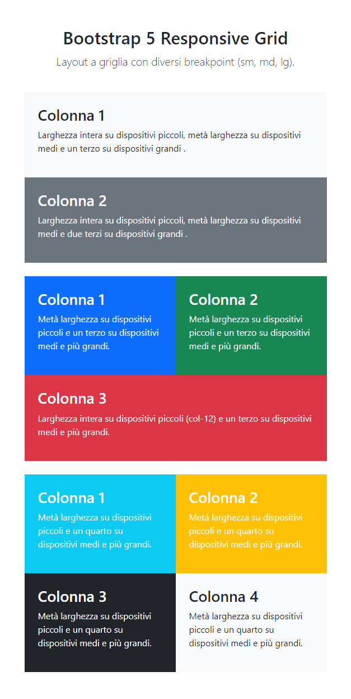
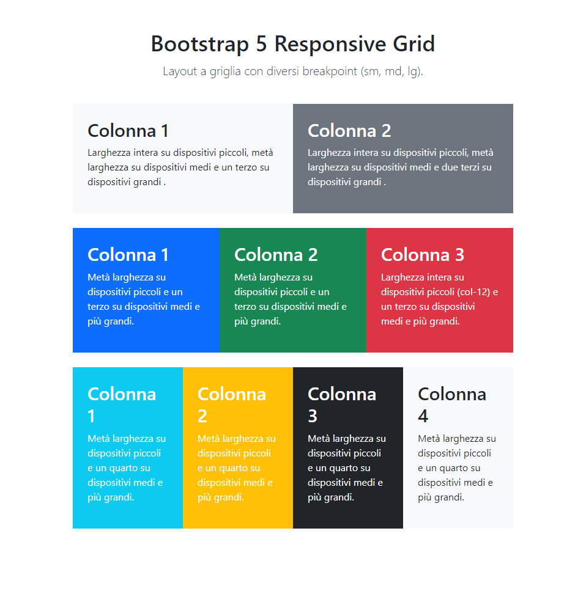
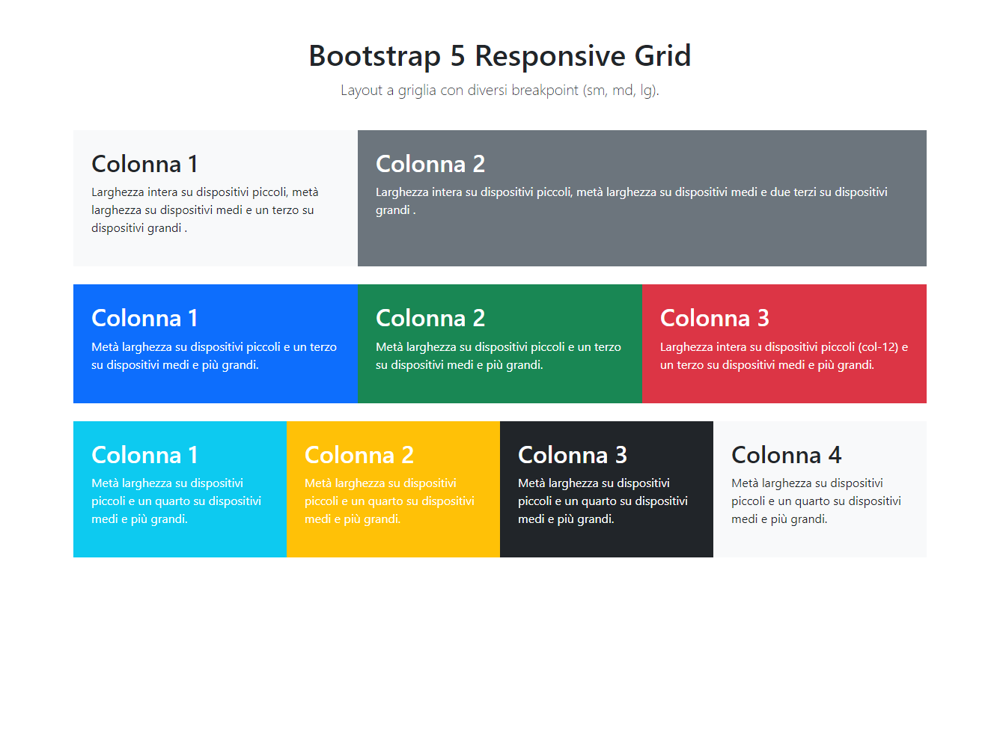

# HTML/CSS Bootstrap Layout

> Tip: Technical decisions are summarized in the [Technical Notes](#technical-notes) section

Static responsive layout built for a web development course
exercise using Bootstrap 5.

## Live Demo

[**View on GitHub Pages &nbsp; 🌐**](https://emanuelefavero.github.io/htmlcss-bootstrap-layout/)

## Exercise Goal

Match the provided reference layouts using the Bootstrap 5
grid system and responsive utilities.

### Reference layouts

#### Mobile

#### Tablet

#### Desktop

## Scope

- Use HTML and Bootstrap 5
- No custom layout system outside the Bootstrap grid
- Recreate the layout across mobile, tablet and desktop
- Keep the code readable, scalable and easy to maintain
- Use `row-cols-*` where it helps reduce repetition without
  making the grid logic less clear
- Centralize the text color where possible to avoid repeated
  `text-white` / `text-dark` utilities

## Technical Notes

- Used Bootstrap `col-*` classes for the asymmetric rows and
  `row-cols-*` only on the last row, where all columns share the
  same layout pattern.
- Centralized text color with `box-dark` and `box-light`
  helper classes to reduce repeated `text-white` / `text-dark`
  utilities.
- Kept Bootstrap responsible for layout, spacing and
  background colors, while using `style.css` for exercise-
  specific typography and helper classes.
- Used `vstack` and `gap-*` utilities to manage vertical
  spacing between the header and row groups.
- Used `clamp()` for typography so text scales fluidly but
  stays within controlled limits on very large screens.

&nbsp;

---

&nbsp;

[**Go To Top &nbsp; ⬆️**](#htmlcss-bootstrap-layout)
